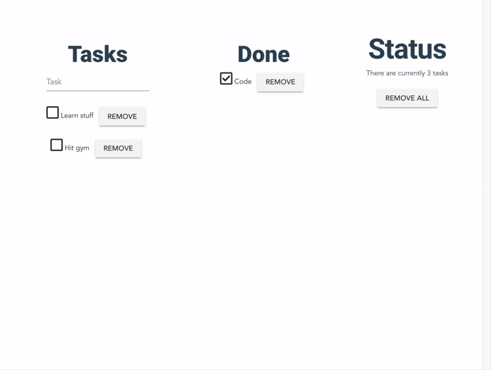

# store-sample

> A ToDo app built just to demonstrate state management using vuex.

Available [here](http://vuex-todo-sample.surge.sh/)



### Contributor Guidelines

- Clone the repository.
- Install the dependencies with ```npm install```
- Run the app locally with ```npm run serve```
- Make your changes.
- Push it to a new branch and submit a PR for review. 

## Project setup
```
npm install
```

### Compiles and hot-reloads for development
```
npm run serve
```

### Compiles and minifies for production
```
npm run build
```

### Run your tests
```
npm run test
```

### Lints and fixes files
```
npm run lint
```
